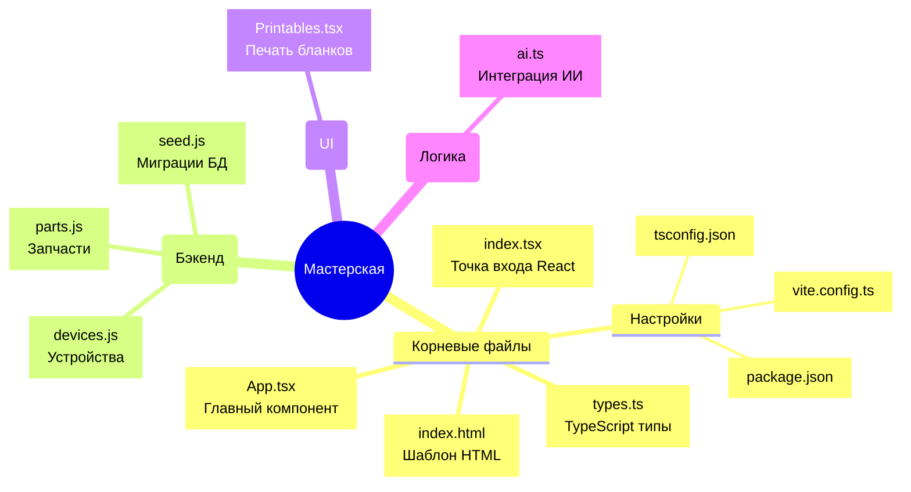

# Карта проекта «Домашняя Мастерская»

## 🧠 Майнд-карта структуры проекта

Ниже представлена визуальная структура всех файлов в проекте. Она разбита на логические блоки: корень приложения (фронтенд), компоненты, интеграции и серверная часть.

---

## 📂 Подробное описание файлов

Здесь мы пройдемся по внутренностям каждого файла на сайте и разберем, какую функцию он выполняет.

### 🏠 Корневые файлы (Фронтенд и конфигурация)

#### 1. `App.tsx` (Сердце приложения)
- **За что отвечает:** Главный файл приложения, в котором собрана практически вся логика фронтенда и основной пользовательский интерфейс.
- **Внутренности:** 
  - Содержит логику загрузки, сохранения и удаления данных из базы данных (через вызовы `fetch` к `/api/`).
  - Управляет состояниями (вкладками): Ремонт (список), Склад запчастей, Печать (бланков), ИИ Диспетчер, База знаний.
  - Содержит встроенную «Базу знаний» со списком типовых неисправностей.
  - Осуществляет рендеринг списков, карточек устройств, модальных окон добавления запчастей и устройств.

#### 2. `index.html` (Каркас сайта)
- **За что отвечает:** Базовый HTML-шаблон, который загружается пользователем.
- **Внутренности:** 
  - Настроены метатеги для обеспечения работы сайта как мобильного приложения (PWA/Standalone).
  - Подключен **Tailwind CSS** через CDN, настроены кастомные фирменные цвета, градиенты, плавные анимации и дизайн скроллбаров.
  - Написаны специальные медиа-запросы `@media print` — они гарантируют, что при нажатии на кнопку "Печать" весь лишний интерфейс скроется, а распечатаются только нужные документы.
  - Применен **Import Maps** для загрузки модулей (React) прямо в браузере.

#### 3. `index.tsx` (Точка входа)
- **За что отвечает:** Инициализация React.
- **Внутренности:** Находит базовый `
` с `id="root"` в файле `index.html` и отрисовывает в нем наш проект (`<App />`).

#### 4. `types.ts` (Типизация)
- **За что отвечает:** Описание всех структур данных для TypeScript.
- **Внутренности:** 
  - Содержит списки (enum) для Статусов (`DeviceStatus` — В работе, Готов и т.д.), срочности работы (`Urgency`).
  - Интерфейсы `Device` (Устройство) и `SparePart` (Запчасть), где четко прописано, какие поля у них должны быть (название, цена, номер телефона, наличие на складе).
  - Интерфейсы для работы чата с ИИ (`ChatMessage`).

#### 5. `Конфиги (vite.config.ts, tsconfig.json, package.json)`
- **`package.json`**: Содержит список зависимостей (Lucide React, Tailwind, Vercel Postgres) и скрипты для запуска и сборки.
- **`vite.config.ts`**: Настройка инструмента сборки Vite (подключен плагин React для быстрой работы проекта).
- **`tsconfig.json`**: Контроллирует строгие правила языка TypeScript для предотвращения ошибок на этапе написания кода.

---

### ⚙️ API (Серверная часть - папка `api/`)
*Эти файлы работают как Serverless-функции в Vercel и обеспечивают связь фронтенда с базой данных Postgres.*

#### 6. `api/devices.js`
- **За что отвечает:** Работа с устройствами (Заказы на ремонт) в базе данных.
- **Внутренности:** 
  - Обрабатывает `GET` запросы: делает SQL-запрос `SELECT * FROM devices` и отдает список JSON.
  - Обрабатывает `POST` запросы: делает INSERT или UPDATE в БД (команда `ON CONFLICT (id) DO UPDATE`), если заказ обновился (например, изменили статус).
  - Обрабатывает `DELETE`: удаляет устройство из базы.

#### 7. `api/parts.js`
- **За что отвечает:** Управление складом радиодеталей и компонентов.
- **Внутренности:** Работает аналогично `devices.js`, но выполняет запросы к таблице `parts`. Поддерживает добавление новых деталей, изменение их количества и статуса "В наличии".

#### 8. `api/seed.js`
- **За что отвечает:** Создание и обновление таблиц БД (Миграции).
- **Внутренности:** 
  - Делает проверку через `CREATE TABLE IF NOT EXISTS` и создает таблицы `devices` и `parts`, если база пустая.
  - Использует конструкцию `ALTER TABLE ... ADD COLUMN IF NOT EXISTS` чтобы безопасно добавлять новые поля (например, цену или приоритет ремонта) к уже существующим таблицам, ничего не ломая при апдейтах версий.

---

### 🧩 Компоненты (Папка `components/`)

#### 9. `components/Printables.tsx`
- **За что отвечает:** Документооборот и печать.
- **Внутренности:** 
  - Содержит верстку для бумажных документов: "Гарантийные пломбы", "Бирки на устройства" и "Акт приема-передачи" / "Акт выдачи".
  - Работает в тандеме с логикой из `index.html` (оттуда берутся `@media print` стили).
  - Генерирует красивые блоки специально под размер бумаги А4, скрывая остальной интерфейс при вызове функции `window.print()`.

---

### 🤖 Сервисы (Папка `services/`)

#### 10. `services/ai.ts`
- **За что отвечает:** Работа с искусственным интеллектом.
- **Внутренности:** 
  - Поддерживает работу с двумя провайдерами: Google Gemini (рекомендуемый) и OpenRouter.
  - Включает хитрые системные промпты. Например функция `generateWorkshopAdvice` превращает ИИ в сурового "Дядю Петровича", который дает советы по ремонту.
  - Функция `beautifyDeviceText` берет ломаное описание проблемы от пользователя и превращает его в технически грамотное (улучшает текст налету).
  - Содержит методы для безопасного сохранения и получения ключа API из LocalStorage браузера пользователя.
